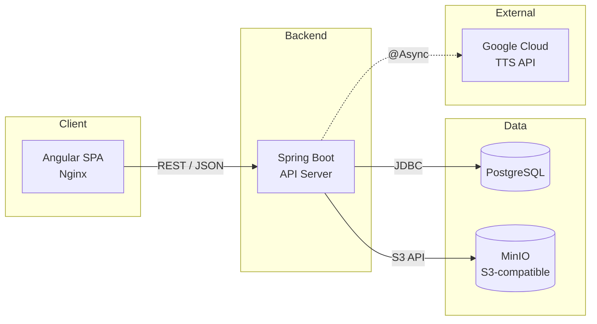
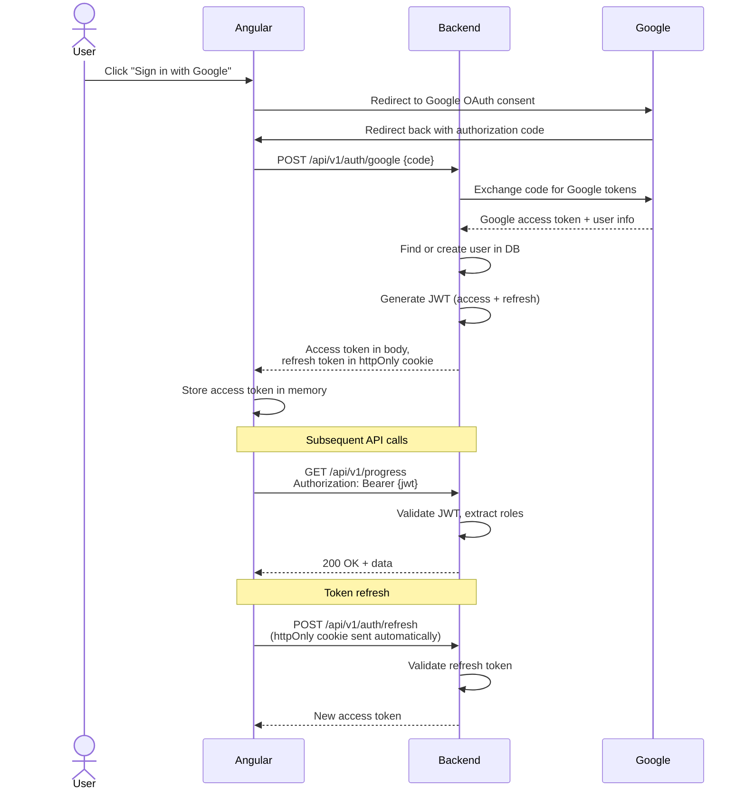
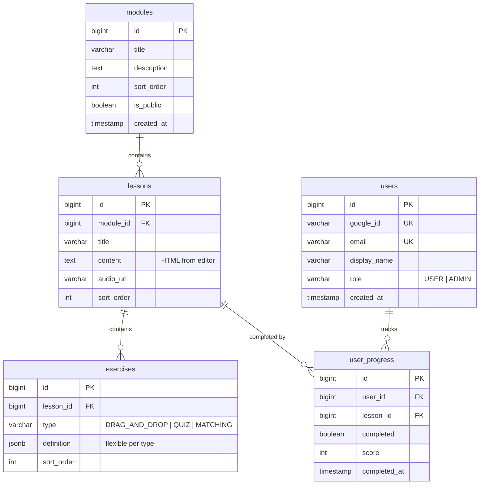

# Architecture

> System design, service boundaries, data flow

## Overview

Droonidest is a drone-related interactive online course platform. The first module is publicly accessible (ABC of drone defence with AI voiceover and SVG animations). The second module requires authentication and contains interactive exercises (e.g. drag-and-drop FPV drone assembly). Administrators manage course content through an in-app editor.

## Tech Stack

| Layer | Technology | Purpose |
|-------|-----------|---------|
| Frontend | Angular 19 (standalone, SCSS) | SPA with lazy-loaded feature modules |
| Backend | Spring Boot 3.4 / Java 21 | REST API, business logic, auth |
| Database | PostgreSQL | Persistent storage |
| Migrations | Flyway | Schema versioning |
| File Storage | MinIO (S3-compatible) | Audio files, images, SVG assets |
| TTS | Google Cloud Text-to-Speech | AI voiceover generation at build time |
| Auth | Google OAuth 2.0 + JWT | Stateless authentication |
| Containerization | Docker + Docker Compose | Local dev, deployment |

### Stack decisions (MVP)

- **No Redis** — JWT-based stateless auth eliminates the need for session storage. Revisit if caching becomes necessary.
- **No RabbitMQ** — Spring `@Async` handles background tasks (e.g. TTS generation). Revisit if we need reliable retries or multiple consumers.
- **MinIO over S3** — Runs locally in Docker, same API as AWS S3. When migrating to AWS, swap the endpoint config with zero code changes.

## System Architecture



## Environments

| Environment | Purpose | Infrastructure |
|-------------|---------|---------------|
| `local` | Developer workstation | Docker Compose (all services) |
| `development` | Shared testing / staging | Docker Compose on VPS |
| `production` | Live site | Docker on VPS (→ AWS later) |

Configuration is managed via Spring profiles (`application-local.yml`, `application-dev.yml`, `application-prod.yml`) and Angular environment files.

## Authentication & Authorization

- **Provider**: Google OAuth 2.0 (via Spring Security OAuth2 Client)
- **Token strategy**: Stateless JWT issued by the backend after Google login
  - Access token: short-lived (15 min), sent in `Authorization: Bearer` header
  - Refresh token: longer-lived (7 days), stored in `httpOnly` cookie
- **Roles**: `USER`, `ADMIN` — stored in the `users` table, embedded in JWT claims
- **Public routes**: Module 1 content, landing page — no auth required
- **Protected routes**: Module 2+, progress tracking, admin panel — JWT required

### Auth Flow



## Backend Structure

Single Spring Boot application, organized by feature:

```
backend/src/main/java/com/app/backend/
├── auth/           # OAuth2 config, JWT filter, token service
├── user/           # User entity, profile, roles
├── course/         # Modules, lessons, content management
├── exercise/       # Exercise engine, types, validation
├── progress/       # User progress, completion tracking
├── storage/        # S3/MinIO file service, upload endpoints
├── admin/          # Admin-specific endpoints, content editing
└── common/         # Shared DTOs, error handling, base entities
```

## Frontend Structure

Angular SPA with lazy-loaded feature modules:

```
frontend/src/app/
├── core/              # Singleton services, interceptors, guards
├── shared/            # Reusable components, pipes, directives
├── features/
│   ├── public-course/ # Module 1 (public), voiceover player, SVG animations
│   ├── auth/          # Login flow, Google OAuth callback
│   ├── dashboard/     # User dashboard, progress overview
│   └── admin/         # Content editor, module management
└── app.routes.ts      # Top-level routing with lazy loading
```

## API Design

- **Base path**: `/api/v1/`
- **Style**: RESTful, resource-oriented
- **Pagination**: Spring `Pageable` for list endpoints
- **DTOs**: Separate request/response objects — never expose JPA entities
- **Error format**:
  ```json
  {
    "error": "VALIDATION_FAILED",
    "message": "Human-readable description",
    "details": [ { "field": "title", "reason": "must not be blank" } ]
  }
  ```
- **Documentation**: `springdoc-openapi` with Swagger UI at `/swagger-ui.html`

### Key resource endpoints

```
GET    /api/v1/modules                    # List course modules (public)
GET    /api/v1/modules/{id}/lessons       # Lessons in a module
GET    /api/v1/modules/{id}/lessons/{id}  # Lesson content + audio URL
GET    /api/v1/exercises/{id}             # Exercise definition
POST   /api/v1/exercises/{id}/submit      # Submit exercise answer
GET    /api/v1/progress                   # Current user's progress
POST   /api/v1/admin/modules              # Create module (admin)
PUT    /api/v1/admin/lessons/{id}         # Update lesson content (admin)
POST   /api/v1/admin/lessons/{id}/generate-audio  # Trigger TTS (admin)
POST   /api/v1/storage/upload             # Upload file (admin)
```

## Database Schema (high-level)



- Exercise definitions use a `jsonb` column so different exercise types (drag-and-drop, quiz, matching) can have different shapes without schema changes.
- Flyway migrations live in `backend/src/main/resources/db/migration/`.

## File Storage

MinIO provides S3-compatible object storage in Docker. The backend uses the AWS S3 SDK.

| Bucket | Contents |
|--------|----------|
| `audio` | TTS-generated voiceover MP3 files |
| `assets` | SVG animations, images, uploaded media |

### Migration path to AWS

| Phase | Storage | Config |
|-------|---------|--------|
| Local / Dev | MinIO in Docker Compose | `s3.endpoint: http://minio:9000` |
| Production (VPS) | MinIO in Docker Compose | `s3.endpoint: http://minio:9000` |
| Production (AWS) | AWS S3 | `s3.endpoint: https://s3.amazonaws.com` |

## Voiceover Pipeline

1. Admin writes/edits lesson text in the content editor
2. Admin clicks "Generate Audio" → backend receives request
3. Spring `@Async` method sends text to Google Cloud TTS API
4. Resulting MP3 is stored in MinIO (`audio` bucket)
5. `audio_url` on the lesson record is updated
6. Frontend plays audio via standard `<audio>` element synced with content

## SVG Animations

- Simple movement animations for MVP (drone flyovers, part highlights)
- SVGs stored in the `assets` bucket or bundled with the frontend
- Animated via Angular animations or CSS keyframes
- Triggered by scroll position or lesson progress

## Content Management (post-MVP)

For MVP, admins manage content via admin API endpoints. A WYSIWYG editor (TipTap or similar) is planned for post-MVP to provide a richer editing experience. Content is stored as HTML in the `lessons.content` column.

## Docker Compose Services

```yaml
services:
  frontend       # Angular built + served via Nginx
  backend        # Spring Boot JAR
  postgres       # PostgreSQL 16
  minio          # MinIO object storage
```

## Gamification (MVP)

- **Progress tracking**: per-lesson and per-module completion percentage
- **Score recording**: exercise results stored in `user_progress`
- **Dashboard**: visual progress bars per module

Post-MVP: badges, achievements, streaks, leaderboards.
